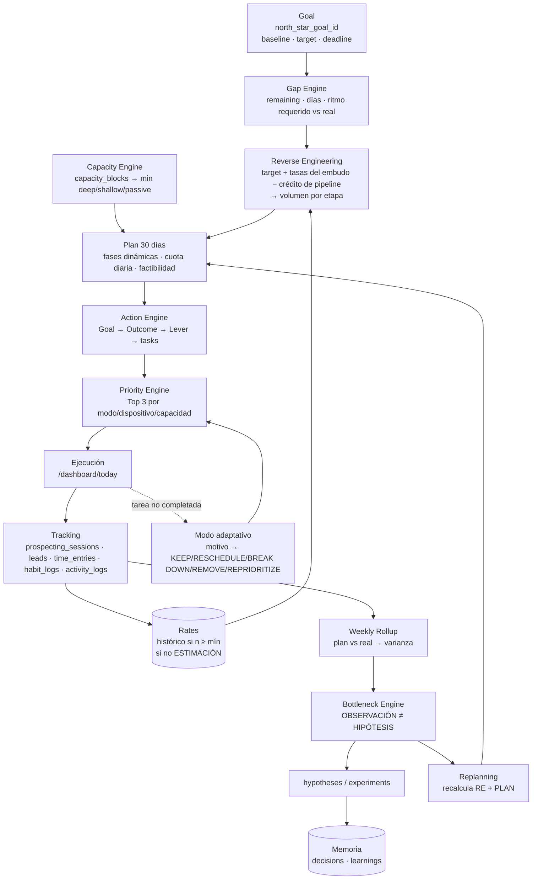

# Personal Executive OS — Auditoría, arquitectura objetivo y roadmap

Fecha: 2026-09-23 · Rama: `dev` @ `9913f6c` · Complementa (no reemplaza) [AUDITORIA_SISTEMA.md](AUDITORIA_SISTEMA.md).

> Convención de este documento: **DATO** = verificado en código/esquema. **SUPOSICIÓN** = no verificable desde aquí. **HIPÓTESIS** = propuesta a validar. **DECISIÓN** = recomendación que requiere tu aprobación.

---

## 0. Límites de esta auditoría (qué NO pude verificar)

| Fuente | Estado | Consecuencia |
|---|---|---|
| Código + migraciones `0001`–`0010` | Leído completo | Base de todo lo que sigue. |
| **Datos reales en Supabase** | **No accesible** (no hay service role, RLS exige sesión — correcto por diseño) | No conozco tus tasas históricas reales. Los números de ejemplo de §6 son **ESTIMACIÓN** ilustrativa, no diagnóstico. |
| **VANT Brain = bóveda de Obsidian** | **Ubicada** (2026-09-23): `C:\VANT\VANT_Brain` — 55 notas: `01_Fundamentos Revolution` (doctrina), `Core/` (hipótesis vivas versionadas), `Experiments/`, `Case Closing/`, `Lead Intelligence/`, `Templates/` con frontmatter | Es la misma bóveda para Obsidian y la VANT Brain. Ver §10. |
| `~/Documents/VANT/` | Existe: `Prospectos Junio.xlsx`, `Propuesta comercial.docx`, `wpp prompt.txt`, proyecto `dev/8perros` | No se importa (decisión del usuario, 2026-09-23). |

---

## 1. AUDITORÍA

### 1.1 Estado actual (resumen)

Stack: Next.js 16.3 (App Router, Server Actions), React 19, Supabase (Postgres + RLS, sin service role), Zod, `@anthropic-ai/sdk` (`claude-sonnet-5`), Tailwind. Sin tests, sin CI, sin cron, sin integraciones externas. **No hace falta agregar ninguna herramienta** (ni n8n, ni Make, ni GHL, ni Notion) para lo que pide la especificación — ver §2.

El sistema hoy es un **STATIC DASHBOARD + TRACKING SYSTEM parcial**. No existe todavía ninguna capa de decisión: nada calcula brechas, volumen requerido, capacidad ni cuellos de botella.

### 1.2 Mapa especificación → código

| Componente de la especificación | Estado | Evidencia |
|---|---|---|
| Capa 1 — Estado (dinero, tiempo, pipeline, restricciones) | **PARCIAL** | `transactions` sí; `financial_accounts`, `debts`, `savings_goals` existen pero ningún código los usa. Tiempo/restricciones: **FALTA** (solo `profiles.weekly_hours_target`, sin uso). Pipeline: solo agregados en `prospecting_sessions`; el real está en Excel. |
| Capa 2 — Objetivos (Punto A/B, deadline, métrica, dependencias) | **PARCIAL** | `goals` tiene `target_value`, `current_value`, `unit`, `deadline`, `priority`, `parent_goal_id`, `kind`. **Falta** el valor inicial (Punto A). Los formularios **no exponen** `parent_goal_id`, `kind` ni `start_date` ([goals.ts:9](lib/actions/goals.ts:9)) → la jerarquía solo se crea por seed. El progreso es 100% manual. |
| Capa 3 — Reverse Engineering | **FALTA** | Lo más cercano: `agencia_settings.daily_outreach_target`, un número **fijo que escribe el usuario**, no un valor calculado. |
| Capa 4 — Time Capacity | **FALTA** | Nada modela sueño/universidad/transporte/bloques. |
| Capa 5 — Action Engine (Goal→Outcome→Lever→Action) | **PARCIAL** | `tasks` → `project_id` → `projects.goal_id`. Las tareas **no tienen `goal_id`**, ni impact/effort/modo/dispositivo. `habits.goal_id` existe en el esquema pero no está en el formulario. |
| Capa 6 — Daily Executive Engine (`/dashboard/today`) | **PARCIAL / DEBE REFACTORIZARSE** | Existe la ruta; agrupa tareas por `priority` (alta/media/baja), 3 por grupo. Sin objetivo, sin capacidad, sin brecha, sin top 3 real. |
| Sistema de prioridades | **DUPLICADO** | Dos lógicas distintas: [today/page.tsx:55](app/dashboard/today/page.tsx:55) (grupos por prioridad) y [dashboard/page.tsx:259](app/dashboard/page.tsx:259) (hoy/vencida → rango → deadline, top 4). Ninguna mira metas. |
| SER / HACER / TENER | **PARCIAL, sin marco** | SER: hábitos + `computeStreak` (ignora `frequency`). HACER: prospección/campañas. TENER: facturación. Nunca se presentan juntos ni con esa semántica. |
| Módulo 1 — Gap Analysis | **FALTA** | Solo `Math.min(100, valor/target)` duplicado en 3 páginas. |
| Módulo 2 — Tracking granular + time allocation | **PARCIAL** | Negocio: agregados por sesión (contactos, respuestas, citas, cierres). **Falta:** follow-ups, asistencia a calls en outbound, propuestas, horas. **Falta** por completo `time_entries`. |
| Modo adaptativo (por qué no se completó) | **FALTA** | `tasks` no guarda motivo; `activity_logs` existe y **nadie escribe en ella**. |
| Módulo 4 — Feedback loop semanal | **FALTA** | `reviews.content` = `{note}` de texto libre. Insights = 3 contadores de toda la historia. |
| Bottleneck Engine | **FALTA** | Las tasas existen (`computeProspectingRates`) pero nadie las compara ni exige un tamaño mínimo de muestra. |
| Módulo 5 — Validación de mercado/nicho | **FALTA** | `prospecting_sessions.offer` es texto libre; no hay nicho, hipótesis ni experimento. |
| Módulo 6 — Plan de 30 días | **FALTA** | — |
| Módulo 7 — Onboarding | **FALTA** | `ai_conversations.type` ya admite `'onboarding'`, pero no se usa. |
| Memoria (facts/decisions/learnings…) | **PARCIAL, sin uso** | `knowledge_items.kind` incluye `'decision'`; `knowledge_links` (grafo polimórfico) existe y **nadie lo usa**. |
| AI Executive Assistant | **PARCIAL** | Buen grounding ([prompt.ts:3](lib/ai/prompt.ts:3)), `message_type` (hecho/inferencia/recomendación) en el esquema **pero nunca se llena**. Recibe datos crudos, no conclusiones calculadas. Historial sin límite, sin prompt caching, sin forma de borrarlo. |
| Obsidian / VANT Brain | **FALTA** (y no ubicado) | — |
| Tests / CI | **FALTA** | Sin Vitest y sin `.github/workflows`. |
| Auditoría previa Fase 1–5 | **Ninguna fase implementada** | Sin `paused_at`/`cancelled_at`, sin `lib/format.ts`, sin índice `goals(parent_goal_id)`, sin tests. |

### 1.3 Problemas nuevos (no incluidos en la auditoría anterior)

1. **La misma meta VANT muestra dos porcentajes distintos.** En el dashboard se compara la **facturación del mes** (`currentMonthRevenue`, [page.tsx:220](app/dashboard/page.tsx:220)) contra `target_value`; en Agencia se compara la **facturación acumulada histórica** (`totalRevenue`, [agencia/page.tsx:64](app/dashboard/agencia/page.tsx:64)) contra el **mismo** `target_value`. Esto incumple la regla 14 (toda métrica con definición clara).
2. **El "closing rate" de Agencia mezcla poblaciones.** `clients.length / callsAttended` ([agencia/page.tsx:67](app/dashboard/agencia/page.tsx:67)) divide *todos* los clientes (de cualquier canal, cancelados incluidos) entre las llamadas atendidas *solo de campañas pagadas*.
3. **Hay dos embudos incompatibles.** Campañas: lead→calificado→agendada→**atendida**. Outbound: contacto→respuesta→cita→cierre, **sin paso de asistencia** ni de propuesta ni de follow-up. No se pueden sumar ni comparar, y el outbound no permite detectar "Low Show Rate".
4. **Tu situación está hardcodeada.** `"Sebastián"` como valor por defecto en 4 archivos (`dashboard/page.tsx`, `today/page.tsx`, `sidebar.tsx`, `layout.tsx`), `"VANT — camino a diciembre"` ([page.tsx:355](app/dashboard/page.tsx:355)), y `vant_clients.ad_spend default 500000` (un supuesto de negocio metido en el esquema, [0004:69](supabase/migrations/0004_mode_and_agencia.sql:69)). Esto viola la regla 6.
5. **13 tablas sin ningún lector ni escritor:** `goal_metrics, milestones, task_dependencies, tags, task_tags, inbox_items, skills, knowledge_links, financial_accounts, debts, savings_goals, notifications, activity_logs`. Varias son justo lo que necesita la especificación (ver §3: se **reutilizan**, no se crean de nuevo).
6. **El asistente de IA calcularía métricas "de cabeza".** Recibe filas crudas (10 sesiones de prospección) y tendría que sacar las tasas él mismo, lo que no es trazable. Los números deben calcularlos funciones puras, y la IA solo interpretarlos.

### 1.4 Riesgos

| Riesgo | Mitigación |
|---|---|
| Construir motores sobre métricas mal definidas (puntos 1–3) | Fase 1: un registro único de métricas antes de cualquier motor. |
| Que el reverse engineering "invente" tasas | Cada tasa lleva `source: historical \| estimate` y `n`; la UI muestra **ESTIMACIÓN** mientras `n < mínimo`. |
| Duplicar el sistema de prioridades por tercera vez | Un solo `lib/engine/priority.ts` que reemplaza las dos lógicas actuales. |
| Crecer el esquema sin necesidad | Solo 5 tablas nuevas (§3); el resto son columnas nuevas o tablas que se reutilizan. |
| Que el pipeline siga viviendo en Excel | Tabla `leads` (Fase 6) con importación CSV. Si no se migra, el bottleneck de follow-up queda **indetectable**. |
| Costo y latencia de la IA | Prompt caching, historial limitado, contexto = salidas de los motores (compactas). |

---

## 2. ARQUITECTURA PROPUESTA

```text
┌──────────────────────── Frontend (Next.js RSC) ────────────────────────┐
│ /dashboard/today  ← Command Center (North Star, Top 3, SER/HACER/TENER, │
│                     bottleneck, "qué cambió desde ayer")                │
│ /dashboard/plan   ← Gap + Reverse Engineering + plan de 30 días         │
│ /dashboard/review ← Weekly rollup (plan vs real → varianza → ajuste)    │
│ /dashboard/validacion ← hipótesis de nicho/oferta + experimentos        │
│ /onboarding       ← 7 bloques progresivos                               │
│ (CRUDs existentes se mantienen)                                         │
└────────────┬───────────────────────────────────────────────────────────┘
             │ Server Actions (patrón existente: auth → zod → guard → DB)
┌────────────▼──────────── Engines (lib/engine/*, PUROS) ────────────────┐
│ metrics-registry · rates · gap · reverse · capacity · priority ·       │
│ allocation · bottleneck · habit-compliance · weekly-rollup · plan30     │
│ Entrada: objetos planos. Salida: objetos + `trace[]` (qué dato/regla).  │
└────────────┬───────────────────────────────────────────────────────────┘
             │ lib/data/* (capa de acceso por entidad, patrón profile.ts + cache())
┌────────────▼────────── Supabase (fuente única de verdad) ──────────────┐
│ Estado · Metas · Acciones · Tracking · Hipótesis/Experimentos · Memoria │
│ RLS por user_id (sin cambios de modelo de seguridad)                    │
└────────────┬───────────────────────────────┬───────────────────────────┘
             │                               │ export unidireccional (script)
┌────────────▼─────────────┐     ┌───────────▼───────────────────────────┐
│ AI (Anthropic SDK)       │     │ Obsidian (espejo de lectura en .md)   │
│ contexto = salidas de    │     │ weekly reviews, decisiones, learnings │
│ los engines + memoria    │     │ Nunca fuente de verdad (fase 1)       │
└──────────────────────────┘     └───────────────────────────────────────┘
```

| Capa | Decisión | Por qué |
|---|---|---|
| **Frontend** | Reutilizar el kit `components/ui`. `/dashboard/today` pasa a ser el Command Center. | Ejecución antes que estética (regla 9). |
| **Backend** | Server Actions (sin API REST). Motores = funciones puras en `lib/engine/`. | Ya es el patrón del repo; las funciones puras se prueban sin servidor. |
| **Database** | Supabase. Se agregan 5 tablas y columnas; se reutilizan 4 tablas hoy sin uso; se elimina 1. | §3. |
| **AI** | La IA **interpreta** y los motores **calculan**. El contexto se arma con `GapResult`, `Plan`, `Bottleneck`, hipótesis activas y aprendizajes. Respuesta en formato OBSERVACIÓN → HIPÓTESIS → ACCIÓN → MÉTRICA → DECISIÓN. | Trazabilidad (regla 13). |
| **Memory / VANT Brain** | Hipótesis, experimentos y `knowledge_items` (decision/learning/fact) + `knowledge_links`. La "VANT Brain" pasa a ser una **vista** sobre esas tablas, no un sistema aparte. | Evita una segunda arquitectura paralela. |
| **Obsidian** | Exportación unidireccional `Supabase → .md` con un script (`npm run export:obsidian`). Sin sincronización bidireccional por ahora. | Una sincronización en dos sentidos agrega conflictos y puntos de fallo sin beneficio demostrado. **HIPÓTESIS**: revisar después de 4 semanas de uso. |
| **Analytics** | Se calcula al momento a partir de eventos; se persiste un **snapshot** solo al cerrar la semana (`reviews.content` estructurado). | Sin vistas materializadas mientras el volumen sea de un solo usuario. |
| **Automation** | Ninguna herramienta externa. Los rollups se generan al abrir la revisión o al cerrarla. Cada escritura automática deja una fila en `activity_logs`. | Regla 15 (auditable) con cero infraestructura nueva. Un cron de Vercel solo si hay evidencia de que hace falta. |

---

## 3. DATA MODEL (solo cambios necesarios)

### 3.1 REUTILIZAR sin cambios de esquema
`areas`, `projects`, `habits`, `habit_logs`, `transactions`, `campaigns`, `calendar_events`, `ai_conversations`, `notes`, `vision` (identidad → SER).

### 3.2 EXTENDER tablas existentes

| Entidad | Cambios | Propósito |
|---|---|---|
| `profiles` | `+ north_star_goal_id uuid → goals`, `+ onboarding_completed_at timestamptz`, `+ onboarding_step int` | Meta principal intercambiable **sin reconstruir nada** (regla 11). Onboarding progresivo que se puede reanudar. |
| `goals` | `+ baseline_value numeric` (Punto A), `+ metric_key text` (vínculo al registro de métricas para calcular progreso solo), `+ progress_source text check in ('manual','derived')`; exponer `parent_goal_id`, `kind`, `start_date` en el formulario | Goal → Outcome = meta padre → sub-metas `kind='metric'` (la jerarquía ya existe). Si `metric_key` está definido, `current_value` lo calcula el sistema. |
| `tasks` | `+ goal_id uuid → goals`, `+ lever text` (outbound, follow_up, offer, content, build, admin, study…), `+ impact_score smallint 1–5`, `+ effort smallint 1–5`, `+ execution_mode text in ('deep','shallow','passive')`, `+ device_required text in ('any','desktop','phone')` | Capa 5 completa. `energy_required`, `estimated_minutes`, `deadline` y `task_dependencies` **ya existen** y se reutilizan. |
| `prospecting_sessions` | `+ shows_count`, `+ proposals_count`, `+ followups_count`, `+ minutes_spent`, `+ hypothesis_id → hypotheses`, `+ experiment_id → experiments`, `+ variant text` | Unifica el embudo: contacto→respuesta→cita→**asistencia**→**propuesta**→cierre. Cada sesión queda atribuida a un nicho/experimento. Se mantiene compatible hacia atrás (defaults en 0). |
| `agencia_settings` | `+ funnel_assumptions jsonb` → `{reply_rate, booking_rate, show_rate, close_rate, sales_cycle_days, minutes_per_contact}` con valores por defecto **nulos** hasta el onboarding; `+ min_sample jsonb` | Las ESTIMACIONES viven como datos editables, no en código. `daily_outreach_target` pasa a ser un **override opcional**; el valor por defecto lo calcula el motor. |
| `vant_clients` | `+ paused_at date`, `+ cancelled_at date`, `+ source_lead_id → leads`; **quitar** `default 500000` de `ad_spend` | Fase 1 de la auditoría previa + trazabilidad de canal → cliente. |
| `reviews` | `content` pasa a un esquema versionado: `{v:1, plan, actual, variance, rates, bottleneck, observations[], hypotheses[], adjustments[], note}`; `type='diaria'` agrega `{energy, focus, progress: bool, note}` | Weekly review y daily log **sin tablas nuevas**. Los snapshots son inmutables: el historial no se destruye (regla 19). |
| `knowledge_items` | `kind` + `'fact','learning','hypothesis_ref'`; `+ confidence smallint`, `+ source text` | Memoria clasificada FACTS / DECISIONS / LEARNINGS. |
| `knowledge_links` | (sin cambios; empezar a usarla) | Enlaza decisión ↔ experimento ↔ hipótesis ↔ meta. |
| `activity_logs` | (sin cambios; empezar a usarla) | Motivos de omisión de tareas (`action='task_skipped'`, `payload {reason, decision}`) y auditoría de cada escritura automática. |
| `ai_messages` | `message_type` se amplía a `('dato','suposicion','hipotesis','decision','resultado','recomendacion')` y **se empieza a llenar** | Separa las categorías que exige la especificación. |

### 3.3 CREAR (5 tablas, cada una justificada)

| Tabla | Campos clave | Relaciones | Por qué no se puede reutilizar otra |
|---|---|---|---|
| `capacity_blocks` | `day_of_week int[]`, `start_time`, `end_time`, `kind in ('sleep','university','transport','meal','exercise','work','deep','shallow','passive','recovery','other')`, `label`, `valid_from`, `valid_to` | `user_id` | Nada modela una disponibilidad recurrente. `calendar_events` es para eventos puntuales (y se usa para excepciones). |
| `time_entries` | `date`, `started_at?`, `minutes`, `category in ('ventas','construccion','estudio','admin','personal','recuperacion','perdido')`, `execution_mode`, `task_id?`, `goal_id?`, `note` | tasks, goals | Time allocation vs. required allocation es imposible sin esto. Es neutral: registra minutos, no juicios. |
| `hypotheses` | `type in ('niche','market','offer','message','channel','volume','other')`, `statement`, `market`, `icp`, `problem`, `attributes jsonb` (urgencia, capacidad de pago, competencia, potencial de oferta 1–5), `confidence 0–100`, `evidence`, `source`, `status in ('untested','testing','validated','rejected')`, `superseded_by → hypotheses` | experiments, prospecting_sessions, leads | Módulo 5. `market_research` **no se crea aparte**: es una hipótesis `type='niche'` con sus atributos. |
| `experiments` | `hypothesis_id`, `metric_key`, `variants jsonb`, `sample_target int`, `started_on`, `ended_on`, `result jsonb`, `decision in ('keep','change','inconclusive')`, `learning_id → knowledge_items` | hypotheses, prospecting_sessions | Ciclo HIPÓTESIS → EXPERIMENTO → DATO → APRENDIZAJE → CAMBIO en el sistema. |
| `leads` | `name`, `company`, `channel`, `hypothesis_id`, `stage in ('contacted','replied','booked','showed','proposal','won','lost')`, `stage_changed_at`, `next_followup_on`, `followups_done int`, `est_value`, `lost_reason`, `notes` | hypotheses, vant_clients | **Condicional (Fase 6).** Con agregados diarios no se puede medir el follow-up pendiente, el ciclo de venta ni el pipeline actual (que es un input del algoritmo de 30 días). Reemplaza el Excel. |

**No se crean** (la especificación las menciona, pero ya existen o no hacen falta): `users` (= `auth.users` + `profiles`), `goal_milestones` (= sub-metas), `daily_logs` y `weekly_reviews` (= `reviews`), `metrics`/`metric_events` (= registro en código + tablas de eventos existentes), `agency_kpis` (= derivado), `market_research` (= `hypotheses`), `memory` (= `knowledge_items` + `knowledge_links`).

### 3.4 ELIMINAR
- `goal_metrics`: la jerarquía de `goals` con `kind='metric'` la reemplaza.
- El resto de tablas sin uso (`milestones`, `tags`, `inbox_items`, `debts`, …) **quedan dormidas**: no cuestan nada y algunas alimentarán la Capa 1 (dinero, obligaciones) más adelante. Borrarlas no aporta ejecución.

### 3.5 Registro de métricas (en código, no en tabla)

`lib/engine/metrics-registry.ts`: cada métrica = `{key, label, definition, numerator, denominator, unit, minSample}`. Ejemplos:

| key | Definición exacta |
|---|---|
| `reply_rate` | respuestas / contactos del **mismo** período y canal |
| `booking_rate` | citas agendadas / respuestas |
| `show_rate` | citas asistidas / citas agendadas |
| `close_rate` | clientes ganados / citas asistidas |
| `mrr` | Σ recurrente mensual de clientes con status `activo` hoy |
| `revenue_cumulative` | Σ facturado real respetando `paused_at`/`cancelled_at` |
| `habit_compliance` | días cumplidos / días exigidos según `frequency` y `days_of_week` |

Corrige los problemas 1–3 de §1.3: cada vista cita un `key`, no una fórmula inline.

---

## 4. PROCESS MAP



---

## 5. ONBOARDING FLOW (preguntas exactas)

Formularios deterministas (no chat): cada respuesta se guarda en una columna concreta. El asistente de IA puede ayudar a redactar, pero no es el mecanismo de captura. Se puede reanudar (`profiles.onboarding_step`). Cada campo acepta "no sé", que se registra como **dato faltante**, no como cero.

**Bloque 1 — Estado actual** → `transactions` / `financial_accounts` / `vant_clients` / `skills`
1. ¿Cuánto dinero tienes disponible hoy (efectivo + cuentas)? *(COP)*
2. ¿Cuánto ingresas al mes y de qué fuentes?
3. ¿Cuánto gastas al mes en obligaciones fijas?
4. ¿Qué proyectos tienes activos ahora? *(lista → `projects`)*
5. ¿Cuántos clientes pagando tienes hoy?
6. ¿Qué habilidades vendibles tienes? *(→ `skills`)*
7. ¿Qué herramientas o infraestructura ya tienes funcionando?

**Bloque 2 — Objetivo** → `goals` + `profiles.north_star_goal_id`
1. ¿Qué quieres conseguir? *(texto)*
2. ¿Cómo lo medirás? *(unidad: clientes, COP, reuniones…)*
3. ¿Cuál es tu valor actual en esa métrica? *(→ `baseline_value`)*
4. ¿Cuál es el valor exacto que quieres alcanzar? *(→ `target_value`)*
5. ¿Para qué fecha? *(→ `deadline`)*
6. ¿Por qué esta fecha? *(restricción real o arbitraria → `note`)*

**Bloque 3 — Restricciones** → `capacity_blocks`
1. ¿A qué hora te acuestas y te levantas normalmente?
2. ¿Qué bloques fijos tienes cada día (universidad, trabajo)? *(día + inicio + fin)*
3. ¿Cuánto tardas en desplazarte y en qué días? *(se clasifica como `passive`)*
4. ¿Qué obligaciones no se pueden mover?
5. ¿Cuántas horas de trabajo profundo sostienes de verdad en un día bueno?
6. ¿Qué recursos tienes (presupuesto, herramientas) y cuáles te faltan?

**Bloque 4 — Prioridades** → `goals.priority`, `status`
1. Lista todos tus objetivos actuales.
2. ¿Cuál tiene el deadline más cercano?
3. Si solo pudieras cumplir uno en los próximos 30 días, ¿cuál sería? *(→ North Star)*
4. De los demás, ¿cuáles pausamos? *(el sistema avisa si quedan más de 3 metas activas con deadline en ≤ 90 días)*

**Bloque 5 — VANT** → `agencia_settings`, `hypotheses(type='offer')`
1. ¿Qué vendes exactamente? *(una frase)*
2. ¿A quién? *(→ hipótesis de ICP)*
3. ¿Qué problema resuelves y cómo sabes que es urgente?
4. ¿Cuál es tu oferta y a qué precio (setup + mensual)?
5. En los últimos 30 días: ¿cuántos prospectos contactaste, cuántos respondieron, cuántas calls agendaste, a cuántas asistieron y cuántos cerraste? *(→ `prospecting_sessions` con fecha de corte: son datos históricos, no estimaciones)*
6. ¿Cuántas conversaciones abiertas tienes hoy y en qué etapa? *(→ `leads`)*
7. ¿Cuánto tarda, en promedio, desde el primer contacto hasta el cierre? *(→ `sales_cycle_days`; "no sé" = ESTIMACIÓN)*

**Bloque 6 — Hipótesis de mercado** → `hypotheses(type='niche')`
1. ¿Qué nichos estás considerando? *(uno o más)*
2. Para cada uno: mercado (USA/Colombia), ICP, problema, urgencia 1–5, capacidad de pago 1–5, competencia 1–5, canal de adquisición.
3. ¿Qué evidencia tienes? *(conversaciones, clientes previos, datos) + fuente*
4. ¿Qué resultados históricos tienes con ese nicho?
5. ¿Qué necesitas validar primero? *(→ primer `experiment`)*
Estado inicial de todo: `untested`. **El sistema no fija ningún nicho.**

**Bloque 7 — Capacidad (calculado, no preguntado)**
Muestra la semana tipo generada desde el Bloque 3: horas deep / shallow / passive / recovery por día. El usuario **confirma o ajusta** los bloques, y después se presenta el primer plan de 30 días.

---

## 6. ALGORITMO DE 30 DÍAS

### Inputs
`goal` (baseline, target, deadline) · `today` · `capacity` (min/día por modo) · `rates` por etapa (`{value, source, n}`) · `pipeline` actual (leads por etapa, Fase 6; antes, conteos del onboarding) · `sales_cycle_days` · `minutes_per_action` por etapa · estado de `hypotheses` (nicho/oferta).

### Lógica

**1. Resolución de tasas** (`rates.ts`, pura)
```
rate_s = histórico(num_s / den_s)  si den_s ≥ minSample_s
       = estimación_s              si no   → etiqueta ESTIMACIÓN
```
DECISIÓN pendiente: empezar con **corte duro** (simple y explicable). Mezcla bayesiana (estimación como prior con peso k) solo si el corte produce saltos bruscos.

**2. Gap**
```
remaining = target − current
days_left = deadline − today
```

**3. Crédito del pipeline existente.** Cada lead en la etapa s ya aporta un cierre esperado igual al producto de las tasas que le faltan:
```
P(cierre | s) = Π rates desde s hasta close
expected_from_pipeline = Σ leads_s × P(cierre | s)
new_needed = max(0, remaining − expected_from_pipeline)
```

**4. Volumen requerido (hacia atrás)**
```
contacts_needed = new_needed / (reply × booking × show × close)
replies_needed  = contacts_needed × reply   … y así por etapa
```

**5. Ventana útil de prospección.** Un contacto que se hace cuando falta menos que el ciclo de venta ya no alcanza a cerrar antes del deadline:
```
outreach_days = días hábiles entre today y (deadline − sales_cycle_days)
daily_contacts = ceil(contacts_needed / outreach_days)
```

**6. Factibilidad contra capacidad**
```
sales_minutes_needed/día = daily_contacts × min_per_contact + follow-ups + calls
factible = sales_minutes_needed ≤ capacidad asignable (deep + shallow + parte de passive)
```
Si **no** es factible, el sistema no maquilla el plan: muestra las palancas cuantificadas (subir la tasa X de a% a b% reduce el volumen en N; reasignar H horas; mover el deadline D días) y la **probabilidad operativa** resultante. Nunca promete el cierre.

**7. Fases dinámicas.** Son énfasis que se solapan, no bloques rígidos:
- **A — Validación:** activa mientras ninguna hipótesis de nicho/oferta esté `validated` o `testing` con muestra suficiente. Duración = días necesarios para conseguir `minSample` contactos en 2–3 nichos al ritmo de capacidad, con un tope configurable (p. ej. 20% de `days_left`). Criterio de salida: una hipótesis supera a las demás en `reply_rate` con muestra mínima, o se alcanza el tope y se escoge la mejor con una advertencia de confianza baja.
- **B — Pipeline:** empieza en paralelo al final de A y ocupa toda la `outreach_window`.
- **C — Conversión:** su peso crece a medida que hay leads en `booked+` (follow-ups, calls, propuestas).
- **D — Optimización:** cada 7 días (weekly rollup) o cuando un experimento alcanza su muestra.

**8. Asignación diaria.** El volumen del día se convierte en tareas con `lever`/`execution_mode`/`device`: la prospección de investigación va a deep, el envío a shallow, y el seguimiento de métricas y respuestas por celular va a passive (transporte).

### Ejemplo ilustrativo — TODO es ESTIMACIÓN, no son tus datos
Con reply 8%, booking 30%, show 70%, close 20%, ciclo de venta de 10 días, 1 cliente en 30 días y pipeline vacío:
tasa total ≈ 0,336% → **≈ 298 contactos** → ventana ≈ 20 días → **≈ 15 contactos/día**. Si la tasa de respuesta real resultara ser 4%, se necesitarían ≈ 30/día; si fuera 12%, ≈ 10/día. Esa sensibilidad es justamente lo que el sistema debe mostrar.

### Outputs
`Plan { phases[], dailyQuota{stage→n}, requiredAllocation{categoría→%}, feasibility{ok, shortfall, levers[]}, expectedCloses, trace[] }`. Cada número apunta a su input (`rate.source`, `n`).

### Feedback
Cada registro nuevo recalcula las tasas; cada semana, el rollup compara `dailyQuota` con lo ejecutado y la varianza entra al Bottleneck Engine:
- Volumen < requerido y tasas ≥ referencia → **Insufficient Volume**.
- Volumen OK y alguna tasa < referencia con n ≥ mín → la etapa con peor ratio (real/referencia) se marca como **observación**, y las causas posibles se proponen como **hipótesis** con un experimento sugerido.
- n < mínimo → **"Dato insuficiente: faltan X contactos en la etapa Y"**. No se emite ningún diagnóstico.
- Leads con `next_followup_on` vencido → **Insufficient Follow-up** (requiere `leads`).
- Si baja el volumen y sube la conversión, se prohíbe la recomendación "envía más" (caso semana 1 vs 2 de la especificación).

---

## 7. KEEP / REFACTOR / EXTEND / CREATE / REMOVE

| | Elementos |
|---|---|
| **KEEP** | RLS, patrón de Server Actions, `isConfigMode`, `lib/date.ts`, `safeRatio`/`safePercent`, `lib/agencia/billing.ts` (con fix), CRUDs de dominio, grounding del prompt, kit de UI |
| **REFACTOR** | `/dashboard/today` → Command Center · las 2 lógicas de prioridad → `priority.ts` · `computeStreak` → `habit-compliance.ts` con `frequency` · `computeBillingSummary` (paused/cancelled) · `%` de meta/closing rate → registro de métricas · `lib/ai/context.ts` → contexto a partir de motores · `money`/`pct` → `lib/format.ts` · strings hardcodeados de usuario |
| **EXTEND** | `profiles`, `goals`, `tasks`, `prospecting_sessions`, `agencia_settings`, `vant_clients`, `reviews.content`, `knowledge_items`, `ai_messages`; empezar a usar `activity_logs`, `knowledge_links`, `task_dependencies`, `vision` |
| **CREATE** | `capacity_blocks`, `time_entries`, `hypotheses`, `experiments`, `leads` (F6); `lib/engine/*`; Vitest; GitHub Actions; `/onboarding`, `/dashboard/plan`, `/dashboard/validacion`; script de exportación a Obsidian |
| **REMOVE** | `goal_metrics`; `default 500000` en `ad_spend`; la página Insights actual (se reemplaza con analítica real en F9) |

---

## 8. ROADMAP DE IMPLEMENTACIÓN

Cada fase termina con `npm run typecheck && npm run lint && npx vitest run` (+ `npm run build` si toca rutas). **Cambio de orden deliberado (DECISIÓN):** Vitest se instala en la Fase 1, no en la 10, porque todos los motores deben nacer con tests.

| Fase | Entregable | Criterio de "hecho" |
|---|---|---|
| **0 · Audit** | Este documento + tus respuestas a §9 | Aprobado |
| **1 · Data foundation** ✅ 2026-09-23 (+ CRUD de hipótesis y embudo completo de prospección, adelantados por pedido) | Vitest + CI (GitHub Actions); `lib/format.ts`; `metrics-registry.ts`; fix de billing + migración `paused_at`/`cancelled_at`; índice `goals(parent_goal_id)`; migración de extensión de `goals`/`tasks`/`profiles`; eliminar `goal_metrics`; quitar hardcodes; tests de `computeStreak`, billing y tasas | Dashboard y Agencia muestran el **mismo** % para la misma meta; tests en verde en CI |
| **2 · Goal / Gap Engine** ✅ 2026-09-23 (`lib/engine/{rates,gap,reverse,plan}.ts`, `/dashboard/plan`, migración 0012; incluye probabilidad Poisson, volumen para 80/90% y bloqueo por etapa en 0%) | `rates.ts`, `gap.ts`, `reverse.ts` (puros + tests); formulario de metas con Punto A, jerarquía y `metric_key`; North Star | Dada una meta, `/dashboard/plan` muestra la brecha y el volumen por etapa con etiqueta ESTIMACIÓN/HISTÓRICO |
| **3 · Daily Execution Engine** ✅ 2026-09-24 (`lib/engine/{capacity,priority}.ts`, `/dashboard/capacity`, Command Center en `/dashboard/today`, modo adaptativo → `activity_logs`, menú móvil; migración 0013) | `capacity_blocks` + `capacity.ts`; `priority.ts` (reemplaza las 2 lógicas); Command Center en `/dashboard/today` (North Star, tiempo disponible, Top 3, secundarias); modo adaptativo → `activity_logs` | Cada mañana responde "¿qué hago hoy?" con ≤ 3 prioridades justificadas |
| **4 · Tracking** ✅ 2026-09-24 (`time_entries` 0014, `lib/engine/allocation.ts`, captura rápida en Hoy, `/dashboard/time` con execution gap de ventas) | `time_entries` + captura rápida (1 toque, móvil); embudo unificado en `prospecting_sessions`; `allocation.ts` (real vs requerido) | La execution gap semanal es visible |
| **5 · SER-HACER-TENER** ✅ 2026-09-24 (`lib/engine/habits.ts` reemplaza `computeStreak`; hábitos → metas y días; check-in diario en `reviews`; bloque SER/HACER/TENER en Hoy) | `habit-compliance.ts` (frecuencias); hábitos → metas en el formulario; daily log (energía/enfoque); las 3 columnas en Today | Cada columna tiene al menos una métrica del registro |
| **6 · VANT Growth Engine** ✅ 2026-09-24 (0015: `leads`, `experiments`; `lib/engine/{bottleneck,plan30,experiments}.ts`; pipeline real desde leads; follow-ups en Hoy; aprendizajes → `knowledge_items`/`knowledge_links`) | `hypotheses`, `experiments`, `leads` (+ importación CSV del Excel), `/dashboard/validacion`, `plan30.ts`, `bottleneck.ts` | El plan de 30 días se regenera con datos reales; el bottleneck distingue observación de hipótesis |
| **7 · AI Executive Assistant** ✅ 2026-09-24 (`lib/ai/engine-context.ts`: contexto = conclusiones de motores; formato OBS/HIP/ACC/MET/DEC; `message_type` (0016); caching; historial 20; rate limit; borrar historial) | Contexto a partir de motores + memoria; formato OBS/HIP/ACC/MET/DEC; `message_type` poblado; prompt caching; historial limitado a N; borrar historial; rate limit | Toda recomendación cita un `trace` o dice qué dato falta |
| **8 · Obsidian / VANT Brain** ✅ 2026-09-24 (`npm run export:obsidian` → `<vault>/Personal OS (sync)/`: hipótesis con evidencia medida, experimentos con resultados por variante, revisiones, aprendizajes. DECISIÓN: carpeta propia en vez de escribir en `Core/`, para no sobrescribir notas curadas) | Clasificación de memoria (`knowledge_items` + links); `npm run export:obsidian`; importación del material existente de VANT | Bloqueado hasta que ubiques la VANT Brain y la bóveda |
| **9 · Analytics / Feedback** | `weekly-rollup.ts`, snapshot en `reviews`, "¿qué cambió desde ayer/esta semana?", Insights real | Cada semana cierra con varianza + bottleneck + ajuste guardados |
| **10 · Tests / CI** | Endurecimiento: cobertura de todos los motores, tests de integración de acciones clave | CI bloquea merges en rojo |

Orden de valor para tu objetivo de 30 días: **1 → 2 → 3 → 6 (parcial: hypotheses + bottleneck) → 4 → 5 → 9 → 7 → 8**. La 6 va antes que la 4 y la 5 porque la adquisición es el cuello de botella del objetivo actual (regla 10).

---

## 9. Respuestas del usuario (2026-09-23)

1. **VANT Brain** = `C:\VANT\VANT_Brain`, la misma bóveda que abre Obsidian.
2. **Datos en Supabase:** todavía no hay datos reales; la prospección empieza ahora. → Todas las tasas arrancan como ESTIMACIÓN; los CRUD de captura deben estar listos (Fase 1).
3. **`Prospectos Junio.xlsx`:** no se importa.
4. **Meta de facturación:** **acumulada**, 20.000.000 COP (≈ 6.100 USD) antes del 2026-12-31. → Todo el sistema usa `revenue_cumulative` (§3.5).

## 10. Lo que la VANT Brain ya aporta (leído, no importado)

| Nota | Tipo | Uso en el sistema |
|---|---|---|
| `Core/Métricas Objetivo - Embudo Adquisición Abogados (Hipótesis v1)` | **HIPÓTESIS** (escenarios conservador/base/optimista de calificación, agendamiento, asistencia y cierre) | Valores iniciales candidatos para `funnel_assumptions` (Fase 2), siempre marcados ESTIMACIÓN. Ojo: son del embudo **pagado**, no del outbound. |
| `Case Closing/2026 - Prospección en frío abogados (historial)` | **DATO histórico agregado**: ~200 contactados, ~100 llamadas, 7 reuniones, 0/7 cierres, sin filtro de facturación | Evidencia para la hipótesis de ICP. **No** se registra como sesión de prospección: no tiene fecha y el proceso era distinto, así que contaminaría las tasas actuales. |
| `Core/Decision Estrategica - Ads vs Cold Outreach (Sept 2026)` | **DECISIÓN histórica** (7 sept): mantener el nicho abogados de familia | Ahora el nicho vuelve a estar **abierto** por instrucción del usuario. La decisión se conserva como hipótesis con su evidencia, no como verdad. |
| `Core/Metas de Facturación (2026-2030)` | Meta declarada: 6.500 USD sept-dic 2026 | **Reemplazada** por la meta del 2026-09-23 (20M COP ≈ 6.100 USD). Conviene actualizar la nota en la bóveda para que no haya dos versiones. |
| `Templates/` (frontmatter `database: experiments`, etc.) | Esquema de las notas | Formato de destino para la exportación a Obsidian (Fase 8): se respetan las carpetas y el frontmatter existentes, sin carpeta nueva. |

**Regla de integración (DECISIÓN propuesta):** Supabase guarda los datos operativos (sesiones, métricas, hipótesis con estado) y la bóveda guarda la doctrina y la narrativa. La exportación escribe en `Experiments/` y `Core/` con versionado (v1, v2…), igual que la metodología del propio vault ("el rechazo también es un dato").
