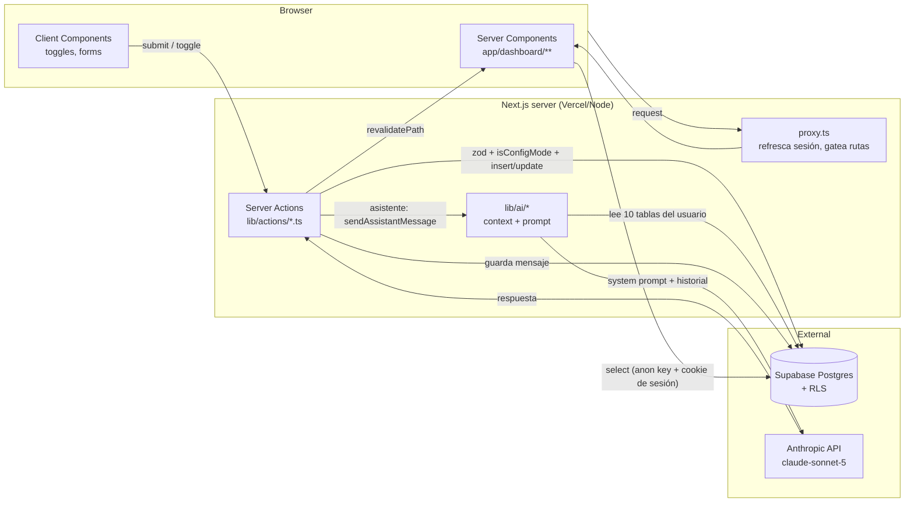

# Auditoría del sistema — Personal OS

Fecha: 2026-09-22 · Alcance: código fuente completo en `dev` (post-commit `f0b2248`, incluyendo cambios sin commitear de modo agencia, asistente IA y migraciones 0008-0010).

---

## 1. Resumen ejecutivo y arquitectura general

### 1.1 Stack

| Capa | Tecnología | Notas |
|---|---|---|
| Framework | Next.js **16.3.3**, App Router | Sin Pages Router. `middleware.ts` se llama ahora `proxy.ts` (convención Next 16). |
| UI | React 19.2.8, Tailwind CSS 3.4, `lucide-react` | Sin librería de componentes (kit propio en `components/ui/`). |
| Formularios/acciones | Server Actions (`"use server"`) + `useActionState` | Sin API routes tipo REST salvo `app/auth/callback/route.ts`. |
| Validación | Zod | Un `schema` por acción en `lib/actions/*.ts`. |
| Datos | Supabase (Postgres + Auth) vía `@supabase/ssr` | RLS como única barrera de acceso; no hay service-role key en ningún lado. |
| Estado | Ninguno global | Todo es Server Components + revalidación (`revalidatePath`); estado de cliente solo local (`useActionState`, toggles). |
| IA | `@anthropic-ai/sdk`, modelo `claude-sonnet-5` | Asistente conversacional en `/dashboard/asistente`. |
| Estilos | CSS variables + Tailwind, tema claro/oscuro explícito (no `prefers-color-scheme`) | `app/globals.css`. |
| Testing | **Ninguno** | No hay `*.test.ts`/`*.spec.ts` propios, ni Vitest/Jest configurado. |
| CI | **Ninguno** | No existe `.github/workflows`; `lint`/`typecheck` son scripts manuales. |

Es una aplicación **mono-tenant real pero multi-usuario por RLS**: cada tabla tiene `user_id` y políticas `auth.uid() = user_id`, sin rol de servicio usado desde cliente ni servidor — decisión de seguridad documentada explícitamente en `supabase/migrations/0002_rls.sql`.

### 1.2 Estructura de carpetas

```
app/
  login/, auth/callback/            → autenticación
  dashboard/
    page.tsx                        → dashboard general (agregación cross-dominio)
    today/                          → vista "hoy" (tareas + hábitos + agenda)
    tasks/ projects/ goals/ habits/ knowledge/ finances/ reviews/ areas/
                                     → un CRUD por dominio (page + create-button + edit-button)
    agencia/                        → sub-módulo "VANT" (adquisición, prospección, clientes, facturación)
    asistente/                      → chat con IA con contexto real del usuario
    insights/                       → placeholder de analítica
components/
  ui/                                → kit propio (Button, Card, Modal, Select, ProgressBar, …)
  sidebar.tsx, mobile-header.tsx, theme-toggle.tsx, mode-toggle.tsx
lib/
  actions/                          → Server Actions, un archivo por dominio (mismo patrón: auth → zod → guard modo-config → supabase → revalidatePath)
  supabase/                         → client.ts (browser), server.ts (RSC/actions), proxy.ts (sesión + gating de rutas)
  agencia/                          → metrics.ts (tasas), billing.ts (facturación VANT) — funciones puras
  ai/                                → context.ts (lee Supabase), prompt.ts (arma system prompt), client.ts (SDK)
  data/profile.ts                   → único data-access helper compartido (cacheado con `cache()` de React)
  date.ts, metrics.ts               → utilidades puras compartidas (fechas por timezone, racha de hábitos)
supabase/migrations/                → 10 migraciones SQL numeradas, sin rollback formal, aplicadas vía Supabase CLI
```

El patrón es muy consistente: **cada dominio repite la misma forma** (schema Zod → verificación de usuario → verificación de `system_mode` si es estructural → mutación → `revalidatePath`). Esto es una fortaleza (predictibilidad) y a la vez la principal fuente de duplicación (ver §3).

### 1.3 Flujo de datos (simplificado)



No hay capa de caché intermedia (Redis, `unstable_cache`, tags de `fetch`): cada navegación al dashboard vuelve a ejecutar todas las consultas contra Supabase.

---

## 2. Mapeo de funcionalidades y flujos clave

### 2.1 Registro y persistencia de hábitos diarios

- **Modelo**: `habits` (definición: título, `frequency` ∈ {diaria, semanal, custom}, `target_per_period`, `days_of_week`, `time_of_day`) + `habit_logs` (una fila por hábito/día, `unique(habit_id, date)`).
- **Registro diario**: [`toggleHabitLog`](lib/actions/habits.ts:89) — upsert si no existe o delete si ya estaba marcado. No requiere modo configuración (es uso diario legítimo); crear/editar/eliminar el hábito en sí **sí** requiere `system_mode = 'config'` vía [`isConfigMode`](lib/actions/guard.ts:10).
- **Cómputo de racha**: [`computeStreak`](lib/metrics.ts:8) — días consecutivos terminando hoy (o ayer, si hoy aún no se ha marcado y el día no ha terminado). Es una función pura, fácil de testear, bien documentada.
- **Punto ciego real**: `frequency`, `target_per_period` y `days_of_week` **se capturan en el formulario y se guardan en la base de datos, pero ningún cálculo los usa**. `computeStreak` trata todo hábito como si debiera cumplirse todos los días — un hábito marcado "Semanal" en la UI ([`FREQUENCY_LABEL`](app/dashboard/habits/page.tsx:13)) no tiene ninguna lógica de cumplimiento distinta a uno diario. Es una función a medio implementar.

### 2.2 Seguimiento de objetivos diarios y metas a 30 días

- **Modelo**: `goals` con jerarquía `parent_goal_id` autorreferenciada y `horizon` ∈ {largo_plazo, anual, trimestral, mensual}. No existe un horizonte "30 días" explícito en el enum.
- **Progreso**: `current_value` / `target_value` — **100% manual**. El usuario edita `current_value` a mano en el formulario de edición ([`updateGoal`](lib/actions/goals.ts:64)); no hay ningún trigger, Server Action ni cálculo que incremente `current_value` cuando se completa una tarea o se marca un hábito. La única lectura del progreso es un ratio simple: `current_value / target_value` en [`GoalsPage`](app/dashboard/goals/page.tsx:59-61).
- **Aproximación a "meta a 30 días"**: solo existe en el sub-módulo Agencia/VANT, no como concepto general:
  - [`nextVantMilestone`](lib/agencia/metrics.ts:127) busca la sub-meta hija (`parent_goal_id`) activa con el `deadline` más próximo — el "próximo hito" que se muestra en el dashboard.
  - [`daysBetween`](lib/agencia/metrics.ts:135) calcula días restantes/vencidos contra ese deadline.
  - La tarjeta "VANT — camino a diciembre" en el [dashboard](app/dashboard/page.tsx:353-436) es el único lugar del sistema que junta *meta + hito + progreso diario* en una vista — pero es específico de un solo dominio (agencia), no un patrón reusable para cualquier meta del usuario.
- Existe además una tabla `goal_metrics` (sub-métricas por meta) creada desde la migración 0001 y protegida por RLS, pero **no la usa ningún archivo de `app/` o `lib/`** — esquema muerto.

### 2.3 Rendimiento semanal y cercanía a la meta

- **No existe un algoritmo de "rendimiento semanal" reusable.** Lo que hay es un cálculo ad-hoc dentro de [`DashboardPage`](app/dashboard/page.tsx:270-277): para cada uno de los últimos 7 días, `% = tareas completadas / tareas programadas ese día`, usado solo para dibujar el gráfico de barras "Progreso semanal". No persiste, no se compara semana contra semana, no incluye hábitos ni metas.
- **Cercanía a la meta**: se resuelve igual en dos lugares con la misma fórmula (`Math.min(100, Math.round((valor/target) * 100))`), duplicada entre `app/dashboard/page.tsx` (VANT) y `app/dashboard/agencia/page.tsx` (facturación) y una tercera vez en `app/dashboard/goals/page.tsx` para metas genéricas — sin una función compartida.
- **Insights** (`app/dashboard/insights/page.tsx`), que por copy promete "Tendencias de tu sistema personal a lo largo del tiempo", en realidad solo muestra 3 contadores *de todos los tiempos* (`count: 'exact'` sin filtro de fecha) — no hay serie temporal ni comparación semana/semana en ningún punto del código.
- **Facturación VANT** (la métrica cuantitativa más sofisticada del sistema) sí tiene un módulo dedicado y bien aislado: [`lib/agencia/billing.ts`](lib/agencia/billing.ts) (fee inicial + recurrente × meses activos) y [`lib/agencia/metrics.ts`](lib/agencia/metrics.ts) (tasas de respuesta/agendamiento/cierre vía `safePercent`/`safeRatio`, que evitan división por cero). Ver hallazgo de corrección en §3.

---

## 3. Diagnóstico de código y calidad

### 3.1 Puntos fuertes

- **RLS exhaustiva y consistente**: las 25+ tablas de usuario tienen las 4 políticas (select/insert/update/delete) con `auth.uid() = user_id`, sin excepciones ni bypass. Es la base de seguridad correcta para este tipo de app.
- **Guardas de "modo configuración" bien pensadas y documentadas**: [`isConfigMode`](lib/actions/guard.ts:10) dice explícitamente que es una salvaguarda de UX, no un control de acceso — evita el error común de confundir ambas cosas.
- **Funciones de cálculo puras y aisladas**: `lib/metrics.ts`, `lib/agencia/metrics.ts`, `lib/agencia/billing.ts`, `lib/date.ts` no tocan I/O, están bien comentadas en el *por qué* (ej. el comentario sobre `system_mode` vs. `mode` colisionando con la función agregada de Postgres en [0004_mode_and_agencia.sql:6-8](supabase/migrations/0004_mode_and_agencia.sql:6)), y son triviales de testear — hoy no tienen tests, pero están listas para tenerlos sin refactor.
- **Manejo de zona horaria centralizado**: `isoDateInTimezone`/`shiftIsoDate` evitan el error clásico de usar `new Date()` del servidor para decidir "hoy" del usuario.
- **Prompt del asistente con reglas anti-alucinación explícitas** ([`GROUNDING_RULES`](lib/ai/prompt.ts:3-11)): obliga a citar solo el contexto real, a decir "no tengo información" cuando falta, y a no modificar metas sin confirmación — diseño de prompt cuidadoso para un asistente que puede influir en decisiones del usuario.
- **`.env.local.example`** documenta con precisión por qué el anon key es público a propósito y por qué el script de seed no usa service role — buena higiene para un repo que un tercero podría clonar.

### 3.2 Code smells y deuda técnica

1. **`computeBillingSummary` sobreestima la facturación acumulada de clientes pausados/cancelados.** En [`lib/agencia/billing.ts:66-83`](lib/agencia/billing.ts:66), `totalRevenue` se calcula como `setup_fee + recurring * monthsActiveSince(start_date, today)` **sin importar el `status` del cliente**. Un cliente `cancelado` hace 3 meses sigue sumando 3 meses de comisión "acumulada" a la métrica que el dashboard llama "Facturación acumulada". Esto infla el número más visible del módulo Agencia. Es el hallazgo de mayor impacto de negocio de esta auditoría porque afecta directamente una cifra que el usuario usará para decisiones.
2. **Hábitos "semanales"/"personalizados" son solo de UI.** Como se explicó en §2.1, `frequency`, `target_per_period`, `days_of_week` no participan en `computeStreak` ni en ningún otro cálculo — la etiqueta que ve el usuario no corresponde a ningún comportamiento distinto.
3. **Cero tests automatizados** sobre lógica con dinero e integridad de datos (facturación, tasas, rachas). Dado que las funciones ya están aisladas y son puras, el costo de empezar es bajo y el retorno es alto.
4. **Sin CI**: `npm run lint` y `npm run typecheck` existen como scripts pero nada los ejecuta en PRs — se puede mergear código que no compila.
5. **`goal_metrics`** es esquema muerto: tabla + RLS desde la migración 0001, sin ningún lector/escritor en el código actual.
6. **Duplicación de formateadores**: `money()` y `pct()` están definidos de forma casi idéntica en `app/dashboard/page.tsx` y `app/dashboard/agencia/page.tsx` en vez de vivir en `lib/format.ts`. Lo mismo pasa con el tipo `TaskRow`, redefinido de forma independiente en `app/dashboard/page.tsx` y `app/dashboard/today/page.tsx`.
7. **Sin capa de acceso a datos**: salvo `lib/data/profile.ts` (que sí usa `cache()` de React para deduplicar entre layout y páginas), el resto de las ~15 páginas hacen sus propios `.from().select()` inline. Cualquier cambio de columna obliga a grepear todo `app/` en vez de tocar un solo archivo por entidad.
8. **`sendAssistantMessage` no escala con el largo de la conversación.** En cada turno de chat ([`lib/actions/assistant.ts:68-159`](lib/actions/assistant.ts:68)):
   - Reconstruye el `MasterContext` completo (10 queries a Supabase) aunque los datos base cambien poco entre mensajes.
   - Envía **todo** el historial de la conversación a la API sin límite ni resumen — el costo y la latencia crecen sin cota a medida que la conversación se alarga.
   - No usa streaming ni `prompt caching` de Anthropic (el `system` prompt es mayormente estable dentro de una sesión de chat — candidato perfecto para `cache_control`).
   - La respuesta es síncrona/bloqueante: el usuario espera el mensaje completo sin feedback incremental.
9. **`next.config.mjs`** solo tiene `reactStrictMode: true` — no aprovecha ninguna de las primitivas de cacheo/PPR de Next 16 pese a que el proyecto ya corre sobre esa versión.

### 3.3 Seguridad y manejo de estado/persistencia

- La seguridad entre usuarios está bien resuelta (RLS + sin service role). No se detectaron políticas faltantes ni tablas sin `enable row level security`.
- Los datos financieros (`transactions`, `debts`, `vant_clients`) están protegidos igual que el resto — correcto para una app mono-usuario-por-fila, sin necesidad de cifrado adicional a este alcance.
- El asistente de IA persiste el historial completo de la conversación en `ai_messages` (texto plano, protegido por RLS según [0009_ai_assistant_rls.sql](supabase/migrations/0009_ai_assistant_rls.sql)) sin política de retención ni forma de que el usuario borre una conversación desde la UI — dado que el usuario puede compartir reflexiones personales/financieras con el asistente, vale la pena una opción de "borrar historial".
- No hay rate limiting en `sendAssistantMessage`: un loop de UI con bug (o un mal uso del formulario) podría generar llamadas repetidas a la API de Anthropic sin control de costo del lado del servidor.

---

## 4. Plan de acción y sugerencias de mejora (priorizadas por impacto)

### Quick wins (bajo esfuerzo, alto impacto)

1. **Corregir `computeBillingSummary`** para dejar de acumular meses de facturación después de que un cliente pasa a `pausado`/`cancelado` (ver §3.2.1 y el ajuste de modelo de datos #15 más abajo — el fix de código real necesita el nuevo campo).
2. **Extraer `money()`/`pct()`** a `lib/format.ts` y reusarlos en `app/dashboard/page.tsx`, `app/dashboard/agencia/page.tsx` y `app/dashboard/goals/page.tsx`.
3. **Añadir un suite de tests mínimo** (Vitest, sin servidor) para `lib/metrics.ts`, `lib/agencia/metrics.ts`, `lib/agencia/billing.ts` y `lib/date.ts` — son las funciones puras ya aisladas, el mayor apalancamiento por hora invertida, y protegen justo los cálculos de dinero y rachas.
4. **Wirear `lint` + `typecheck` a GitHub Actions** en cada PR.
5. **Decidir el destino de `goal_metrics`**: implementar la UI que sugiere o eliminar tabla + RLS para reducir superficie de esquema sin uso.

### Mejoras de interfaz/UX para acelerar el registro diario ("mente en blanco")

6. **Vincular automáticamente el progreso de metas** a tareas/hábitos completados (p. ej. una meta `kind = 'metric'` enlazada a un hábito suma `current_value` sola en cada `toggleHabitLog`). Hoy el usuario tiene que recordar entrar a "Metas" y escribir un número a mano — este es el mayor freno a que el tracking de "cercanía a la meta a 30 días" sea preciso y esté siempre al día.
7. **Convertir Insights en una vista real de tendencia**: reusar el patrón de ventana de 7/30 días que ya existe en el dashboard (`habitLogStart`, `weekStart`) para mostrar sparklines por hábito y por meta, en vez de contadores de todos los tiempos.
8. **Atajo de captura rápida en "Hoy"**: un único punto para marcar un hábito, completar una tarea o capturar un pensamiento sin cambiar de página — reduce la fricción exacta del momento de "mente en blanco" que describe el usuario.
9. **Implementar de verdad `frequency`/`days_of_week`/`target_per_period`** en `computeStreak` (o quitar esas opciones del formulario si no se van a usar) — evita que la UI prometa un comportamiento que el sistema no cumple.

### Refactorización prioritaria

10. **Capa de acceso a datos por entidad** (`lib/data/tasks.ts`, `lib/data/goals.ts`, …) siguiendo el patrón ya validado en `lib/data/profile.ts` (incluyendo `cache()` de React para deduplicar consultas repetidas en la misma request, como el dashboard que hace `Promise.all` en dos bloques separados).
11. **Streaming + prompt caching en el asistente**: usar el streaming del SDK de Anthropic para feedback incremental, y `cache_control` en el system prompt de `lib/ai/prompt.ts` para no re-tarificar el contexto completo en cada turno; truncar o resumir el historial más allá de N mensajes.
12. **Rollup semanal automático**: en vez de que `reviews.content` sea una nota de texto libre, generar automáticamente un snapshot estructurado (cumplimiento de tareas, rachas de hábitos, delta de metas) al cerrar la semana, y dejar la nota del usuario como complemento, no como único contenido.

### Ajustes en el modelo de datos

13. **`vant_clients`**: agregar `paused_at`/`cancelled_at` (timestamp) para poder calcular correctamente cuántos meses debió facturar un cliente — esto es el arreglo de raíz del hallazgo #1 de §3.2, no solo un parche de código.
14. **Índice en `goals(parent_goal_id)`**: hoy solo existen índices en `goals(user_id)` y `goals(area_id)` ([0001_schema.sql:319-320](supabase/migrations/0001_schema.sql:319)), pero tanto `nextVantMilestone` como el contexto del asistente recorren la jerarquía por `parent_goal_id`.
15. Si se implementa el ítem 6 (auto-vínculo hábito → meta), evaluar una vista materializada o columna agregada para el cumplimiento de 30 días en vez de recalcularlo desde `habit_logs` en cada carga del dashboard.

---

**Resumen en una línea**: la base (RLS, Server Actions, separación de dominios) es sólida y consistente; el hueco real está en que **el tracking "a 30 días" y el "rendimiento semanal" que pide el usuario no existen como concepto general del sistema** — hoy viven parcialmente en el módulo VANT y el resto es manual o ausente (Insights). Cerrar ese hueco (ítems 6-8 y 13) tiene más impacto en el objetivo del usuario que cualquier refactor de arquitectura.
